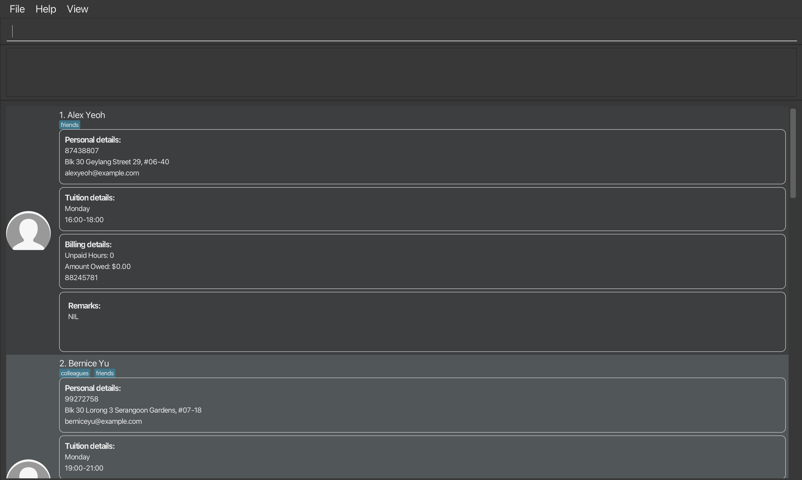

This project is based on the AddressBook-Level3 project created by the [SE-EDU initiative](https://se-education.org).

* This is **an Address Book tailored for university students who are doing private part-time tuition**. 
  Benefits:
  * Tracks your schedule, and indicates conflicting timings
  * Tracks your students, and tuition details from location, payment, and learning pace
* The project simulates an ongoing software project for a desktop application (called _AddressBook_) used for managing contact details.
  * It is **written in OOP fashion**. It provides a **reasonably well-written** code base **bigger** (around 6 KLoC) than what students usually write in beginner-level SE modules, without being overwhelmingly big.
  * It comes with a **reasonable level of user and developer documentation**.
* It is named `AddressBook Level 3` (`AB3` for short) because it was initially created as a part of a series of `AddressBook` projects (`Level 1`, `Level 2`, `Level 3` ...).
* For the detailed documentation of this project, see the **[Address Book Product Website](https://se-education.org/addressbook-level3)**.
* This project is a **part of the se-education.org** initiative. If you would like to contribute code to this project, see [se-education.org](https://se-education.org/#contributing-to-se-edu) for more info.
