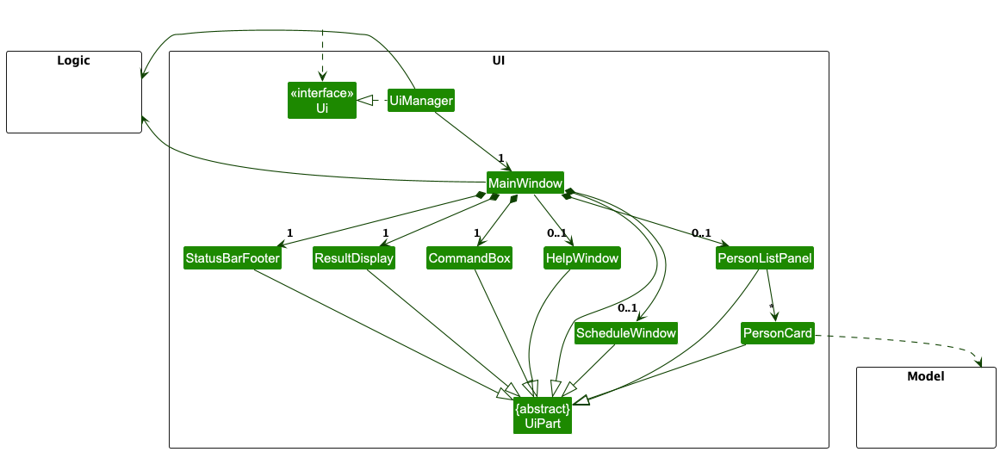
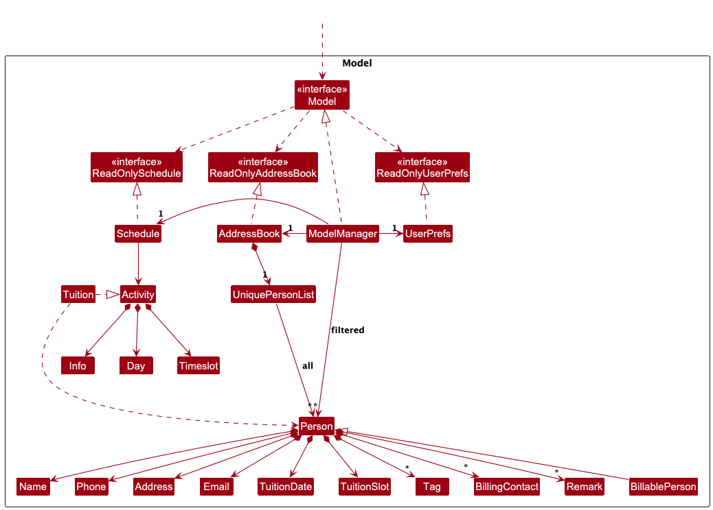
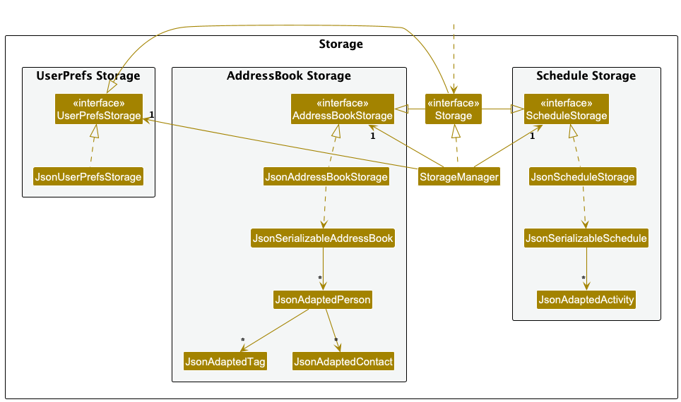
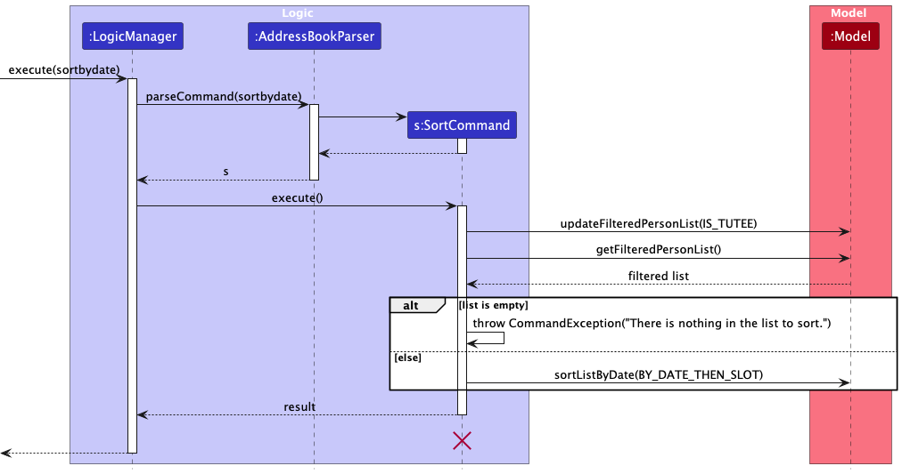
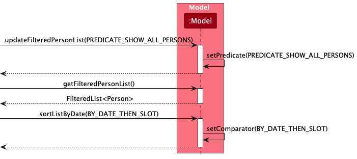

* Table of Contents
{:toc}

--------------------------------------------------------------------------------------------------------------------

## **Acknowledgements**

* This project is based on the AddressBook-Level3 project created by the [SE-EDU initiative](https://se-education.org).

--------------------------------------------------------------------------------------------------------------------

## **Setting up, getting started**

Refer to the guide [_Setting up and getting started_](SettingUp.md).

--------------------------------------------------------------------------------------------------------------------

## **Design**

:bulb: **Tip:** The `.puml` files used to create diagrams are in this document `docs/diagrams` folder. Refer to the [_PlantUML Tutorial_ at se-edu/guides](https://se-education.org/guides/tutorials/plantUml.html) to learn how to create and edit diagrams.

### Architecture

The ***Architecture Diagram*** given above explains the high-level design of the App.

Given below is a quick overview of main components and how they interact with each other.

**Main components of the architecture**

**`Main`** (consisting of classes [`Main`](https://github.com/se-edu/addressbook-level3/tree/master/src/main/java/seedu/address/Main.java) and [`MainApp`](https://github.com/se-edu/addressbook-level3/tree/master/src/main/java/seedu/address/MainApp.java)) is in charge of the app launch and shut down.
* At app launch, it initializes the other components in the correct sequence, and connects them up with each other.
* At shut down, it shuts down the other components and invokes cleanup methods where necessary.

The bulk of the app's work is done by the following four components:

* [**`UI`**](#ui-component): The UI of the App.
* [**`Logic`**](#logic-component): The command executor.
* [**`Model`**](#model-component): Holds the data of the App in memory.
* [**`Storage`**](#storage-component): Reads data from, and writes data to, the hard disk.

[**`Commons`**](#common-classes) represents a collection of classes used by multiple other components.

**How the architecture components interact with each other**

The *Sequence Diagram* below shows how the components interact with each other for the scenario where the user issues the command `delete 1`.

Each of the four main components (also shown in the diagram above),

* defines its *API* in an `interface` with the same name as the Component.
* implements its functionality using a concrete `{Component Name}Manager` class (which follows the corresponding API `interface` mentioned in the previous point.

For example, the `Logic` component defines its API in the `Logic.java` interface and implements its functionality using the `LogicManager.java` class which follows the `Logic` interface. Other components interact with a given component through its interface rather than the concrete class (reason: to prevent outside component's being coupled to the implementation of a component), as illustrated in the (partial) class diagram below.

The sections below give more details of each component.

### UI component

The **API** of this component is specified in [`Ui.java`](https://github.com/se-edu/addressbook-level3/tree/master/src/main/java/seedu/address/ui/Ui.java)

The UI consists of a `MainWindow` that is made up of parts e.g.`CommandBox`, `ResultDisplay`, `PersonListPanel`, `StatusBarFooter` etc. All these, including the `MainWindow`, inherit from the abstract `UiPart` class which captures the commonalities between classes that represent parts of the visible GUI.

The `UI` component uses the JavaFx UI framework. The layout of these UI parts are defined in matching `.fxml` files that are in the `src/main/resources/view` folder. For example, the layout of the [`MainWindow`](https://github.com/se-edu/addressbook-level3/tree/master/src/main/java/seedu/address/ui/MainWindow.java) is specified in [`MainWindow.fxml`](https://github.com/se-edu/addressbook-level3/tree/master/src/main/resources/view/MainWindow.fxml)

The `UI` component,

* executes user commands using the `Logic` component.
* listens for changes to `Model` data so that the UI can be updated with the modified data.
* keeps a reference to the `Logic` component, because the `UI` relies on the `Logic` to execute commands.
* depends on some classes in the `Model` component, as it displays `Person` object residing in the `Model`.

### Logic component

**API** : [`Logic.java`](https://github.com/se-edu/addressbook-level3/tree/master/src/main/java/seedu/address/logic/Logic.java)

Here's a (partial) class diagram of the `Logic` component:

The sequence diagram below illustrates the interactions within the `Logic` component, taking `execute("delete 1")` API call as an example.

:information_source: **Note:** The lifeline for `DeleteCommandParser` should end at the destroy marker (X) but due to a limitation of PlantUML, the lifeline continues till the end of diagram.

How the `Logic` component works:

1. When `Logic` is called upon to execute a command, it is passed to an `AddressBookParser` object which in turn creates a parser that matches the command (e.g., `DeleteCommandParser`) and uses it to parse the command.
1. This results in a `Command` object (more precisely, an object of one of its subclasses e.g., `DeleteCommand`) which is executed by the `LogicManager`.
1. The command can communicate with the `Model` when it is executed (e.g. to delete a person). 
   Note that although this is shown as a single step in the diagram above (for simplicity), in the code it can take several interactions (between the command object and the `Model`) to achieve.
1. The result of the command execution is encapsulated as a `CommandResult` object which is returned back from `Logic`.

Here are the other classes in `Logic` (omitted from the class diagram above) that are used for parsing a user command:

How the parsing works:
* When called upon to parse a user command, the `AddressBookParser` class creates an `XYZCommandParser` (`XYZ` is a placeholder for the specific command name e.g., `AddCommandParser`) which uses the other classes shown above to parse the user command and create a `XYZCommand` object (e.g., `AddCommand`) which the `AddressBookParser` returns back as a `Command` object.
* All `XYZCommandParser` classes (e.g., `AddCommandParser`, `DeleteCommandParser`, ...) inherit from the `Parser` interface so that they can be treated similarly where possible e.g, during testing.

### Model component
**API** : [`Model.java`](https://github.com/se-edu/addressbook-level3/tree/master/src/main/java/seedu/address/model/Model.java)

The `Model` component,

* stores the address book data i.e., all `Person` objects (which are contained in a `UniquePersonList` object).
* stores the currently 'selected' `Person` objects (e.g., results of a search query) as a separate _filtered_ list which is exposed to outsiders as an unmodifiable `ObservableList<Person>` that can be 'observed' e.g. the UI can be bound to this list so that the UI automatically updates when the data in the list change.
* stores a `UserPref` object that represents the user’s preferences. This is exposed to the outside as a `ReadOnlyUserPref` objects.
* does not depend on any of the other three components (as the `Model` represents data entities of the domain, they should make sense on their own without depending on other components)

### Storage component

**API** : [`Storage.java`](https://github.com/se-edu/addressbook-level3/tree/master/src/main/java/seedu/address/storage/Storage.java)

The `Storage` component,
* can save address book data, schedule data, and user preference data in JSON format, and read them back into corresponding objects.
* inherits from `AddressBookStorage`, `ScheduleStorage` and `UserPrefStorage`, which means it can be treated as either one (if the functionality of only one is needed).
* depends on some classes in the `Model` component (because the `Storage` component's job is to save/retrieve objects that belong to the `Model`)

### Common classes

Classes used by multiple components are in the `seedu.address.commons` package.

--------------------------------------------------------------------------------------------------------------------

## **Implementation**

This section describes some noteworthy details on how certain features are implemented.

### Sortbydate feature

Given below shows the sequence diagram of how the sortbydate command goes through the Logic component.

:information_source: **Note:** The lifeline for `SortCommand` should end at the destroy marker (X) but due to a limitation of PlantUML, the lifeline reaches the end of diagram.

The calls to Model class shown above are shown in detail in the sequence diagram below.

#### Proposed Implementation

The proposed undo/redo mechanism is facilitated by `VersionedAddressBook`. It extends `AddressBook` with an undo/redo history, stored internally as an `addressBookStateList` and `currentStatePointer`. Additionally, it implements the following operations:

* `VersionedAddressBook#commit()` — Saves the current address book state in its history.
* `VersionedAddressBook#undo()` — Restores the previous address book state from its history.
* `VersionedAddressBook#redo()` — Restores a previously undone address book state from its history.

These operations are exposed in the `Model` interface as `Model#commitAddressBook()`, `Model#undoAddressBook()` and `Model#redoAddressBook()` respectively.

Given below is an example usage scenario and how the undo/redo mechanism behaves at each step.

Step 1. The user launches the application for the first time. The `VersionedAddressBook` will be initialized with the initial address book state, and the `currentStatePointer` pointing to that single address book state.

Step 2. The user executes `delete 5` command to delete the 5th person in the address book. The `delete` command calls `Model#commitAddressBook()`, causing the modified state of the address book after the `delete 5` command executes to be saved in the `addressBookStateList`, and the `currentStatePointer` is shifted to the newly inserted address book state.

Step 3. The user executes `add n/David …​` to add a new person. The `add` command also calls `Model#commitAddressBook()`, causing another modified address book state to be saved into the `addressBookStateList`.

:information_source: **Note:** If a command fails its execution, it will not call `Model#commitAddressBook()`, so the address book state will not be saved into the `addressBookStateList`.

Step 4. The user now decides that adding the person was a mistake, and decides to undo that action by executing the `undo` command. The `undo` command will call `Model#undoAddressBook()`, which will shift the `currentStatePointer` once to the left, pointing it to the previous address book state, and restores the address book to that state.

:information_source: **Note:** If the `currentStatePointer` is at index 0, pointing to the initial AddressBook state, then there are no previous AddressBook states to restore. The `undo` command uses `Model#canUndoAddressBook()` to check if this is the case. If so, it will return an error to the user rather
than attempting to perform the undo.

The following sequence diagram shows how an undo operation goes through the `Logic` component:

:information_source: **Note:** The lifeline for `UndoCommand` should end at the destroy marker (X) but due to a limitation of PlantUML, the lifeline reaches the end of diagram.

Similarly, how an undo operation goes through the `Model` component is shown below:

The `redo` command does the opposite — it calls `Model#redoAddressBook()`, which shifts the `currentStatePointer` once to the right, pointing to the previously undone state, and restores the address book to that state.

:information_source: **Note:** If the `currentStatePointer` is at index `addressBookStateList.size() - 1`, pointing to the latest address book state, then there are no undone AddressBook states to restore. The `redo` command uses `Model#canRedoAddressBook()` to check if this is the case. If so, it will return an error to the user rather than attempting to perform the redo.

Step 5. The user then decides to execute the command `list`. Commands that do not modify the address book, such as `list`, will usually not call `Model#commitAddressBook()`, `Model#undoAddressBook()` or `Model#redoAddressBook()`. Thus, the `addressBookStateList` remains unchanged.

Step 6. The user executes `clear`, which calls `Model#commitAddressBook()`. Since the `currentStatePointer` is not pointing at the end of the `addressBookStateList`, all address book states after the `currentStatePointer` will be purged. Reason: It no longer makes sense to redo the `add n/David …​` command. This is the behavior that most modern desktop applications follow.

The following activity diagram summarizes what happens when a user executes a new command:

#### Design considerations:

**Aspect: How undo & redo executes:**

* **Alternative 1 (current choice):** Saves the entire address book.
  * Pros: Easy to implement.
  * Cons: May have performance issues in terms of memory usage.

* **Alternative 2:** Individual command knows how to undo/redo by
  itself.
  * Pros: Will use less memory (e.g. for `delete`, just save the person being deleted).
  * Cons: We must ensure that the implementation of each individual command are correct.

_{more aspects and alternatives to be added}_

--------------------------------------------------------------------------------------------------------------------

## **Documentation, logging, testing, configuration, dev-ops**

* [Documentation guide](Documentation.md)
* [Testing guide](Testing.md)
* [Logging guide](Logging.md)
* [Configuration guide](Configuration.md)
* [DevOps guide](DevOps.md)

--------------------------------------------------------------------------------------------------------------------

## **Appendix: Requirements**

### Product scope

**Target user profile**:

* Private tuition teacher who does one-on-one physical classes in Singapore, aged 21 years old, doing part-time studies
* prefer desktop apps over other types
* can type fast
* prefers typing to mouse interactions
* is reasonably comfortable using CLI apps

**Value proposition**:
* Managing Tutee contacts
* Managing timing conflicts: Tuition classes / Study schedule
  * Note that we do not support activities that span across midnight.
* Tracking of billing status
* Tracking of Tutee’s learning topic status (via Remarks)

### User stories

Priorities: High (must have) - `* * *`, Medium (nice to have) - `* *`, Low (unlikely to have) - `*`

| Priority | As a …​                               | I want to …​                                                                    | So that I can…​                                             |
|-----|---------------------------------------|---------------------------------------------------------------------------------|-------------------------------------------------------------|
| `* * *` | new user                              | see information page                                                            | refer to instructions when I forget how to use the App      |
| `* * *` | student                               | add my own schedule                                                             | I can account for potential timetable conflicts with my own schedule|
| `* * *` | student                               | delete my schedule                                                              | I can free up the timeslot                          |
| `* * *` | tuition teacher                       | add a tutee’s data                                                              |  |
| `* * *` | tuition teacher                       | delete a tutee's data                                                           |             |
| `* * *` | tuition teacher                       | get the emails of all my current tutees                                         | I can email them their homework for the week       |
| `* * *` | tuition teacher                       | get the billing contact of all my current tutees                                | I can contact them about payment       |
| `* * *` | tuition teacher                       | get the address of my tutee                                                     | I can proceed to the location for the lesson       |
| `* * *` | tuition teacher                       | sort the list of tutees according to date of lesson                             | I can see more easily who I am teaching next       |
| `* *` | tuition teacher                       | get the amount each tutee owes                                                  | I know how much I should be getting |
| `* *` | tuition teacher                       | leave notes on what my tutee is weak in                                         | I know how to help them more        |
| `* *` | tuition teacher and part-time student | have a daily overview of my activities for the day                              | I know and can prepare for my day efficiently       |
| `*` | tuition teacher | I can get suggested time slots for new tutees based on lesson date and duration | I can slot in new tutees more easily       |
| `*` | expert user                           | I can create shortcuts for tasks                                                | I can save time on frequently performed tasks       |

### Use cases

(For all use cases below, the **System** is the `TuitionSync` and the **Actor** is the `user`, unless specified otherwise)

**Use case: Add a tutee**

**MSS**

1. User enters details for the new tutee.
2. TuitionSync adds the tutee.

    Use case ends.

**Extensions**

* 1a. User does not enter all compulsory details.
  * 1a1. TuitionSync shows an error message.

    Use case resumes at step 1.

* 1b. User enters details with incorrect format.
  * 1b1. TuitionSync shows an error message.

    Use case resumes at step 1.

* 1c. User enters a name that already exists.
  * 1c1. TuitionSync shows an error message.

    Use case resumes at step 1.

* 1d. User enters a timeslot that is already occupied.
  * 1d1. TuitionSync shows an error message.

    Use case resumes at step 1.

**Use case: Delete a tutee**

**MSS**

1.  User requests to list tutees.
2.  TuitionSync shows a list of tutees.
3.  User requests to delete a specific tutee in the list.
4.  TuitionSync deletes the tutee.

    Use case ends.

**Extensions**

* 2a. The list is empty.

  Use case ends.

* 3a. The given index is invalid.

    * 3a1. TuitionSync shows an error message.

      Use case resumes at step 2.

**Use case: Add own schedule**

**MSS**

1. User enters details for the activity.
2. TuitionSync adds the activity to schedule.

    Use case ends.

**Extensions**

* 1a. User enters details with incorrect format.
  * 1a1. TuitionSync shows an error message.

    Use case resumes at step 1.

* 1b. User enters a timeslot that is already occupied.
  * 1b1. TuitionSync shows an error message.

    Use case resumes at step 1.

**Use case: Sort list of tutees by date**

**MSS**

1. User requests to list tutees by date.
2. TuitionSync shows a list of tutees sorted by date of tuition.

    Use case ends.

**Extensions**

* 2a. The list is empty.

    Use case ends.

**Use Case: Edit a person**

Assumption: User can already view the person that they wish to edit

**MSS**

1. User requests to edit person at a certain index and the fields to be changed
2. TuitionSync edits the person at the specified index, changing the specified fields

**Extensions**

* 1a. User enters details with incorrect format.
    * 1a1. TuitionSync shows an error message.

      Use case resumes at step 1.

### Non-Functional Requirements
**Performance**
1. The system should  be able to load all contacts upon opening of the app within 2 seconds.
2. All function calls should take no more than 1 second to complete.
3. Should be able to hold up to 1000 persons without a noticeable sluggishness in performance for typical usage.

**Reliability**
1. The system should be able to handle a certain number of data and requests without slowing down.
2. The system should consistently perform its functions without critical failures, and it should be able to recover quickly from interruptions.

**Usability**
1. Users should be able to input data easily and intuitively and understand the system output easily.
2. The system should offer a specific error message if user input is wrong.
3. A user with above average typing speed for regular English text (i.e. not code, not system admin commands) should be able to accomplish most of the tasks faster using commands than using the mouse.

**Compatibility**
1.  Should work on any _mainstream OS_ as long as it has Java `17` or above installed.

### Glossary

* **TutionSync**: An address book that caters towards private tution teachers who studies part-time, and helps them keep track of their contacts, schedule, and activity locations.
* **Mainstream OS**: Windows, Linux, Unix, MacOS

--------------------------------------------------------------------------------------------------------------------

## **Appendix: Instructions for manual testing**

Given below are instructions to test the app manually.

:information_source: **Note:** These instructions only provide a starting point for testers to work on;
testers are expected to do more *exploratory* testing.

### Launch and shutdown

1. Initial launch

   1. Download the jar file and copy into an empty folder

   1. Double-click the jar file Expected: Shows the GUI with a set of sample contacts. The window size may not be optimum.

1. Saving window preferences

   1. Resize the window to an optimum size. Move the window to a different location. Close the window using the command `exit`

   1. Re-launch the app by double-clicking the jar file. 
       Expected: The most recent window size and location is retained.

### Deleting a person

1. Deleting a person while all persons are being shown

   1. Prerequisites: List all persons using the `list` command. Multiple persons in the list.

   1. Test case: `delete 1` 
      Expected: First contact is deleted from the list. Details of the deleted contact shown in the status message. Timestamp in the status bar is updated.

   1. Test case: `delete 0` 
      Expected: No person is deleted. Error details shown in the status message. Status bar remains the same.

   1. Other incorrect delete commands to try: `delete x`, `...` (where x is larger than the list size) 
      Expected: Similar to previous.

### Showing current schedule
1. Showing current schedule
   1. Test case: `schedule`   Expected: Tutee list will be gone and instead a schedule view will be shown. Success message shown on status message.
   2.    Test case: `schedule hh`   Nothing done. Error details shown in the status message.

### Adding an Activity
1. Adds an activity with the parameters of information (about the activity), date, and time.
   1. Test case: `addactivity i/CCA d/wednesday s/15:00-16:00`   Expected: Activity added to the schedule in chronological order. Details of the added activity will be shown in the status message.
   2. Test case: `addactivity d/tuesday s/12:00-13:00`   Expected: No activity added. Error details shown in the status message.
   3. Other incorrect test cases: `addactivity i/CCA s/12:00-13:00`, `addactivity i/ Class d/tuesday s/9:00-13:00`   Expected: Similar to previous.

### Deleting an Activity
1. Deletes an activity specified by the time and time of the activity.
   1. Prerequisites: Activity slot needs to be exact and reflect an activity slot in the current schedule.
   2. Prerequisites: Activity deleted cannot be a tuition slot, that was added via `add command` in address book.
   2. Test case: `deleteactivity d/thursday s/18:00-20:00`   Expected: Deletes an activity. Deleted activity details will be shown on status message.

### Editing unpaid hours
1. Editing the unpaid hours of a tutee while all tutees are being shown
   1. Prerequisites: List all tutees using the `list` command. Multiple tutees in the list.
   2. Test case: `edithours 1 h/7`   Expected: First contact in the list will now have 7 unpaid hours reflected.
      Details of the edited contact shown in the status message.
   3. Test case: `edithours 0 h/7`   Expected: No hours edited. Error details shown in the status message.
   4. Test case: `edithours 1 h/-1`   Expected: No hours edited. Error details shown in the status message.

### Indicating that a tutee has paid in full
1. Indicating that a tutee has paid his/her amount owed in full.
    1. Prerequisites: List all tutees using the `list` command. Multiple tutees in the list.
   2. Test case: `paidfull 3`   Expected: First contact in the list will now have 0 unpaid hours and $0.00 amount owed.
      Details of the edited contact shown in the status message.
   3. Other test cases: Refer to "Deleting a person" above

### Getting the address of a tutee
1. Getting the address of a tutee using his/her name.
    1. Prerequisites: List all tutees using the `list` command. Multiple tutees in the list.
   2. Test case: `getaddress David Li`   Expected: Retrieves the email of David Li, if such a person exists in the address book. Address will be shown in the status message, allowing users to copy it.
   3. Test case: `getaddress Doe`   Expected: If there are 2 persons with the surname Doe in the address book, then no address will be returned. Error message shown in the status message.

### Sorting by date
1. Sorting tutees based on their tuition date first then slot timing.
   1. Test case: `sortbydate`   Expected: All tutees will be sorted and shown. Success message shown in status message.
   2. Test case: `sortbydate hh`   Nothing done. Error details shown in the status message.

--------------------------------------------------------------------------------------------------------------------

## **Appendix: Planned Enhancements**

Team size: 3

1. **Restricting persons and schedule commands to only execute when the user can see their data** Currently, the user is able to edit people from the addressbook
   despite being on the schedule page. Additionally, users can add activities despite being on the list of people's page. This can cause accidental deletions or unintended edits
   as users are not able to see what exactly they are editing. A future enhancement is for commands to check if the user is on the right page before execution.

2. **Checking for close / similar contacts to prevent duplicate entries** Currently, the Address Book checks for duplicate by finding exact matches to a contact's `name`, `phone`, `email` and `address`.
This means that if the user inputs anything that is slightly off it will result in another entry. However, this system may be too strict for users and can cause alot of duplicate entries. To combat this, 
future versions can check for similar looking persons in the address book and prompt the user about these entries before adding or cancelling the entry.

