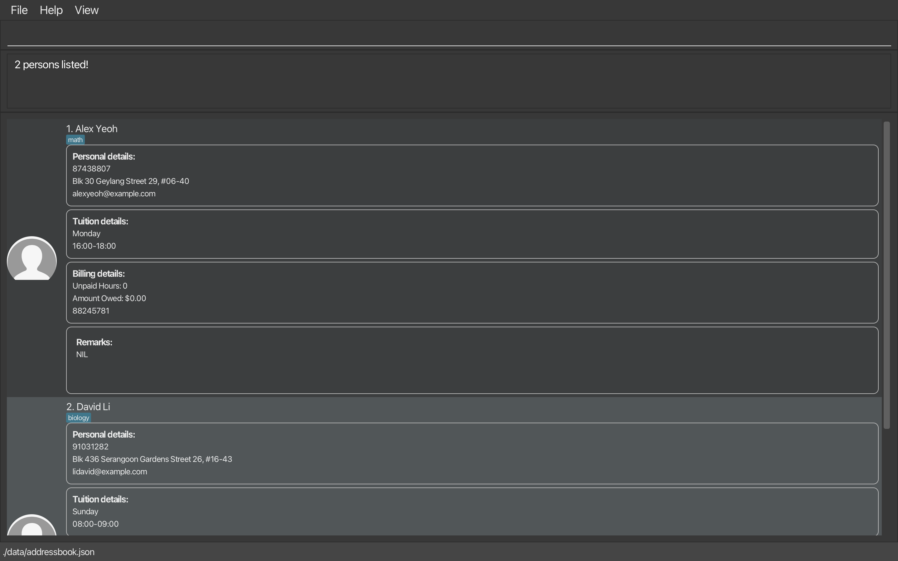
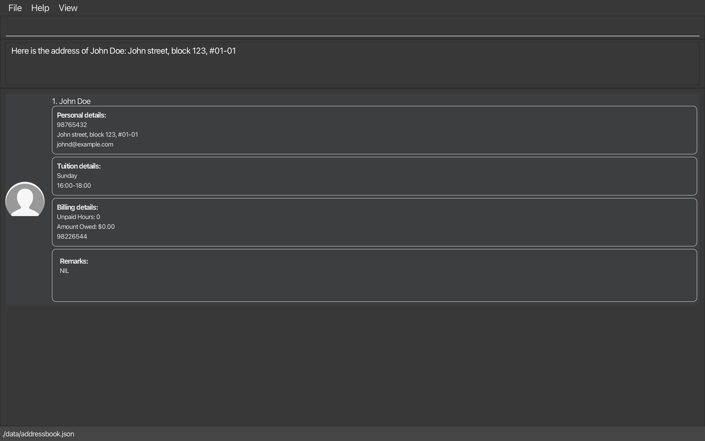
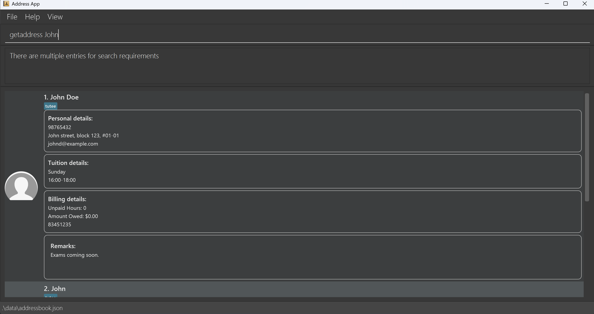
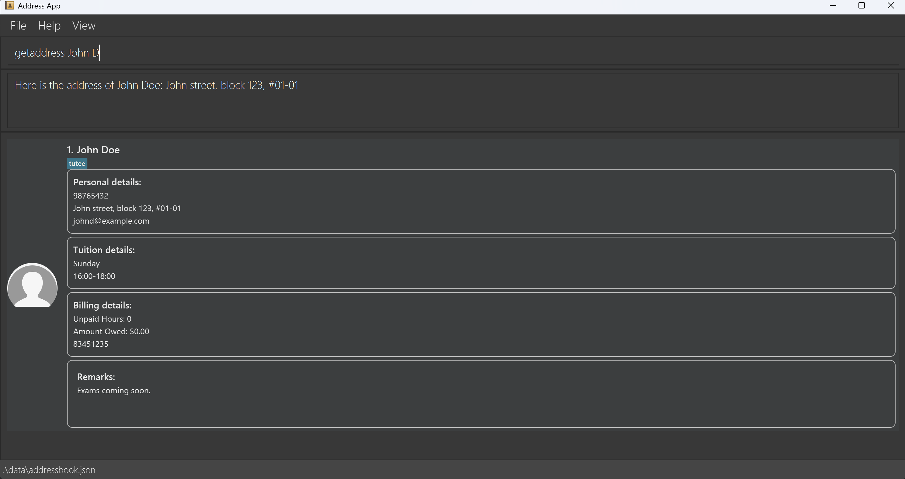
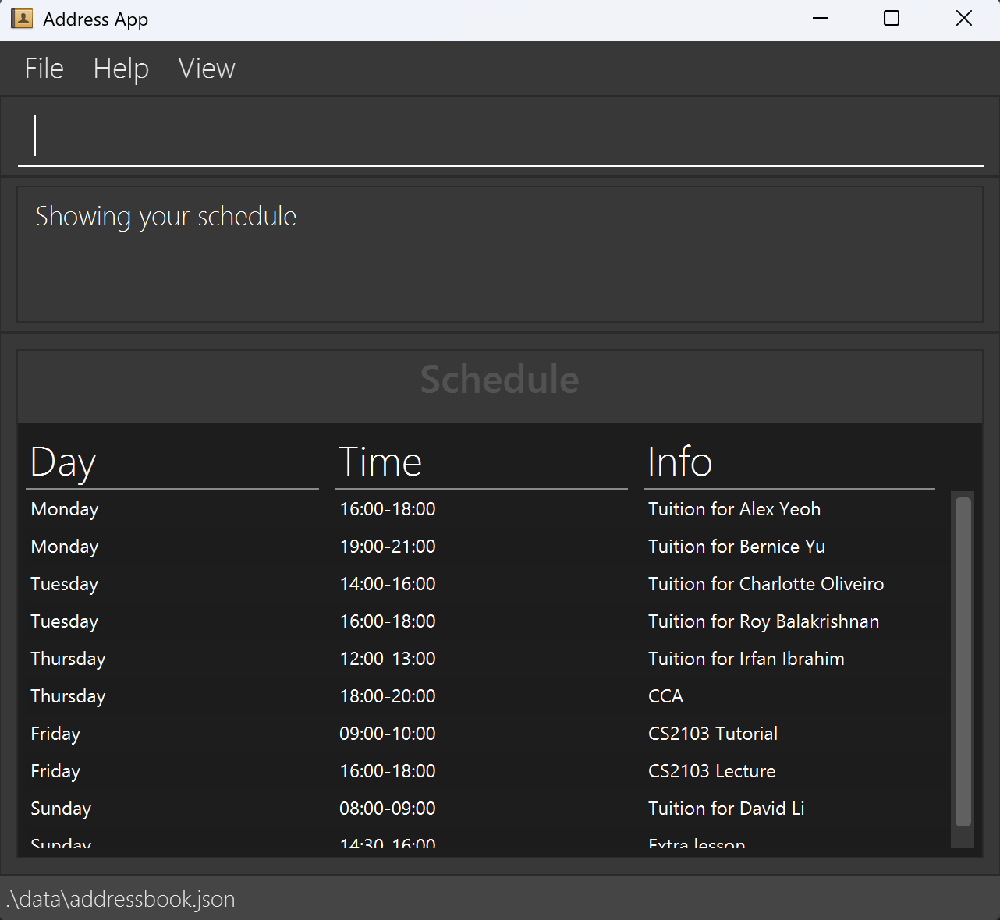

TuitionSync is a **desktop app for private tutors managing tutees' contacts and tuition/personal scheduling, optimized for use via a Command Line Interface** (CLI) while still having the benefits of a Graphical User Interface (GUI). If you can type fast, TuitionSync can get your contact management tasks done faster than traditional GUI apps.
Note that all contacts added to TuitionSync will automatically be taken as a tutee, regardless of whether it is tagged as tutee.

* Table of Contents
{:toc}

--------------------------------------------------------------------------------------------------------------------

## Quick start

1. Ensure you have Java `17` or above installed in your Computer. 
   **Mac users:** Ensure you have the precise JDK version prescribed [here](https://se-education.org/guides/tutorials/javaInstallationMac.html).

1. Download the latest `.jar` file from [here](https://github.com/AY2526S1-CS2103-F09-2/tp/releases).

1. Copy the file to the folder you want to use as the _home folder_ for your AddressBook.

1. Open a command terminal, `cd` into the folder you put the jar file in, and use the `java -jar addressbook.jar` command to run the application. 
   A GUI similar to the below should appear in a few seconds. Note how the app contains some sample data. 
   

1. Type the command in the command box and press Enter to execute it. e.g. typing **`help`** and pressing Enter will open the help window. 
   Some example commands you can try:

   * `list` : Lists all tutees.

   * `add n/John Doe p/98765432 e/johnd@example.com a/John street, block 123, #01-01 d/sunday s/16:00-18:00 b/98226544` : Adds a tutee named `John Doe` to the Address Book.

   * `delete 3` : Deletes the 3rd contact shown in the current list.

   * `clear` : Deletes all tutees and activities.

   * `exit` : Exits the app.

1. Refer to the [Features](#features) below for details of each command.

--------------------------------------------------------------------------------------------------------------------

## Features

**:information_source: Notes about the command format:** 

* Words in `UPPER_CASE` are the parameters to be supplied by the user. 
  e.g. in `add n/NAME`, `NAME` is a parameter which can be used as `add n/John Doe`.

* Items in square brackets are optional. 
  e.g `n/NAME [t/TAG]` can be used as `n/John Doe t/friend` or as `n/John Doe`.

* Items with `…`​ after them can be used multiple times including zero times. 
  e.g. `[t/TAG]…​` can be used as ` ` (i.e. 0 times), `t/friend`, `t/friend t/family` etc.

* Parameters can be in any order. 
  e.g. if the command specifies `n/NAME p/PHONE_NUMBER`, `p/PHONE_NUMBER n/NAME` is also acceptable.

* Extraneous parameters for commands that do not take in parameters (such as `help`, `list`, `exit` and `clear`) will cause an error. 
  e.g. if the command specifies `help 123`, it will result in an error message.

* All commands are case-sensitive. e.g. if the command specifies `Help`, it will cause an error as the `help` command should be lowercase.
* If you are using a PDF version of this document, be careful when copying and pasting commands that span multiple lines as space characters surrounding line-breaks may be omitted when copied over to the application.

## General Commands

### Viewing help : `help`

Shows a message explaining how to access the help page.

Format: `help`

### Clearing all entries : `clear`

Clears all entries from the list of tutees of the address book, as well as all activities in schedule.

Format: `clear`

### Exiting the program : `exit`

Exits the program.

Format: `exit`

## Persons-specific commands

### Listing all persons : `list`

Shows a list of all persons in the address book.

Format: `list`

### Adding a person: `add`

Adds a person to the address book.

Format: `add n/NAME p/PHONE_NUMBER e/EMAIL a/ADDRESS d/DATE s/TIME_SLOT [r/REMARK] [b/BILLING_CONTACT] [t/TAG]…​`

* Phone number and billing contact must be exactly 8 digits long, with only numerical values.
* Tags can only be one word, alphanumeric.
* When successfully added, the tuition date and timeslot will be added to schedule.

:bulb: **Tip:**
A person can have any number of tags (including 0)

Examples:
* `add n/John Doe p/98765432 e/johnd@example.com a/John street, block 123, #01-01 d/sunday s/16:00-18:00 b/98226544`
* `add n/Betsy Crowe e/betsycrowe@example.com a/Newgate Street p/12345678 d/saturday s/16:00-18:00 t/cousin r/Exams soon`

### Deleting a person : `delete`

Deletes the specified person from the address book.

Format: `delete INDEX`

* Deletes the person at the specified `INDEX`.
* The index refers to the index number shown in the displayed person list.
* The index **must be a positive integer** 1, 2, 3, …​

Examples:
* `list` followed by `delete 2` deletes the 2nd person in the address book.
* `find Betsy` followed by `delete 1` deletes the 1st person in the results of the `find` command.

### Editing a person : `edit`

Edits an existing person in the address book.

Format: `edit INDEX [n/NAME] [p/PHONE] [e/EMAIL] [a/ADDRESS] [d/DATE] [s/TIME_SLOT] [r/REMARK] [b/BILLING_CONTACT] [t/TAG]…​`

* Edits the person at the specified `INDEX`. The index refers to the index number shown in the displayed person list. The index **must be a positive integer** 1, 2, 3, …​
* At least one of the optional fields must be provided.
* Existing values will be updated to the input values.
* Phone number and billing contact must be exactly 8 digits long, with only numerical values.
* When editing tags, the existing tags of the person will be removed i.e adding of tags is not cumulative.
* You can remove all the person’s tags by typing `t/` without
    specifying any tags after it.
* This edit command is seperate from another edit commands which enables editing of unpaid hours (see below)

Examples:
*  `edit 1 p/91234567 e/johndoe@example.com` Edits the phone number and email address of the 1st person to be `91234567` and `johndoe@example.com` respectively.
*  `edit 2 n/Betsy Crower t/` Edits the name of the 2nd person to be `Betsy Crower` and clears all existing tags.

### Locating persons by name: `find`

Finds persons whose names contain any of the given keywords.

Format: `find KEYWORD [MORE_KEYWORDS]`

* The search is case-insensitive. e.g `hans` will match `Hans`
* The order of the keywords does not matter. e.g. `Hans Bo` will match `Bo Hans`
* Only the name is searched.
* Only full words will be matched e.g. `Han` will not match `Hans`
* Persons matching at least one keyword will be returned (i.e. `OR` search).
  e.g. `Hans Bo` will return `Hans Gruber`, `Bo Yang`

Examples:
* `find John` returns `john` and `John Doe`
* `find alex david` returns `Alex Yeoh`, `David Li` 
  

### Sorting tutees by tuition date : `sortbydate`

Returns a list of tutees sorted by tuition date first, then time slot of tuition.

Format: `sortbydate`

### Editing a person unpaid hours : `edithours`

Edits the unpaid hour of an existing tutee in the address book.

Format: `edithours INDEX h/HOURS`

* Edits the unpaid hour of the tutee at the specified `INDEX`. The index refers to the index number shown in the displayed person list. The index **must be a positive integer** 1, 2, 3, …​
* HOURS must be provided, cannot be negative, cannot be the same number as the hours currently reflected and cannot be greater than 1000
* Existing values will be updated to the input values.
* Note: This command does not add on hours to current values, rather it changes the unpaid hours to the input value.

Examples:
*  `edithours 1 h/5` Edits the unpaid hours of the 1st person to be `5`.

### Paid in full : `paidfull`

Changes the unpaid hours and amount owed of the specified person to 0 and $0.00 respectively.

Format: `paidfull INDEX`

* Indicates the person at the specified `INDEX` has no unpaid hours or amount owed.
* The index refers to the index number shown in the displayed person list.
* The index **must be a positive integer** 1, 2, 3, …​

### Getting address : `getaddress`

Gets the address of the specified person.

Format: `getaddress  NAME`

* The name specified is case-insensitive. e.g `hans` will match `Hans`
* If there is more than one person that matches the NAME specified, an error message "There are multiple entries for search requirements" will be shown.
* Tip: Make the NAME as specific as possible to avoid multiple matches.

Examples:
* `getaddress John Doe` returns `John street, block 123, #01-01`

### Getting amount owed : `getamountowed`

Gets the amount owed of the specified person.

Format: `getamountowed  NAME`

* The name specified is case-insensitive. e.g `hans` will match `Hans`
* If there is more than one person that matches the NAME specified, an error message "There are multiple entries for search requirements" will be shown.
* Tip: Make the NAME as specific as possible to avoid multiple matches.

Examples:
* `getamountowed John Doe` returns `$0.00`

### Getting billing contact : `getbillingcontact`

Gets the billing contact of the specified person.

Format: `getbillingcontact NAME`

* The name specified is case-insensitive. e.g `hans` will match `Hans`
* If there is more than one person that matches the NAME specified, an error message "There are multiple entries for search requirements" will be shown.
* Tip: Make the NAME as specific as possible to avoid multiple matches.

Examples:
* `getbillingcontact John Doe` returns `98226544`

### Getting email : `getemail`

Gets the email of the specified person.

Format: `getemail NAME`

* The name specified is case-insensitive. e.g `hans` will match `Hans`
* If there is more than one person that matches the NAME specified, an error message "There are multiple entries for search requirements" will be shown.
* Tip: Make the NAME as specific as possible to avoid multiple matches.

Examples:
* `getemail John Doe` returns `johndoe@example.com`

### More on Get Commands
This section describes in more detail the expected behaviour of the `get` commands.

When using these commands, the `NAME` parameters acts as partial matches for full names.
We illustrate using `getaddress` as an example:

When the AB3 has only one user called `John Doe`, applying `getaddress John Doe` will return John's email.

When the AB3 has two users, one called `John` and one called `John Doe`, applying `getaddress John` will return
both `John` and `John Doe` person card and return the multiple entries error.

When the AB3 has two users, one called `John` and one called `John Doe`, applying `getaddress John D` will return
`John Doe`'s email.

## Schedule-specific commands 

### Listing schedule : `schedule`

Shows a list of your current schedule

Format: `schedule`

### Add activity : `addactivity`

Adds an activity to your schedule.

Format: `addactivity i/ACTIVITY_INFO d/DAY s/TIMESLOT`

* Activity info can be no longer than 100 characters.
* The format for the timeslot strictly follow `HH:MM-HH:MM`, it cannot extend past midnight and `00:00` is taken to be midnight of the day stated.
* Timeslot cannot have the starting time be earlier or the same as the end time.
* Acitivty to be added cannot clash with existing activites.
* Day input must be the full name of the day, case-insensitive.

Examples:
* `addactivity i/lesson d/friday s/09:00-10:00`

### Delete activity : `deleteactivity`

Deletes an activity from your schedule.

Format: `deleteactivity d/DAY s/TIMESLOT`

Examples:
* `deleteactivity d/friday s/09:00-10:00`

### Saving the data

AddressBook data are saved in the hard disk automatically after any command that changes the data. There is no need to save manually.

### Editing the data file

AddressBook data are saved automatically as a JSON file `[JAR file location]/data/addressbook.json`. Advanced users are welcome to update data directly by editing that data file.

:exclamation: **Caution:**
If your changes to the data file makes its format invalid, AddressBook will discard all data and start with an empty data file at the next run. Hence, it is recommended to take a backup of the file before editing it. 

Furthermore, certain edits can cause the AddressBook to behave in unexpected ways (e.g., if a value entered is outside of the acceptable range). Therefore, edit the data file only if you are confident that you can update it correctly.

### Archiving data files `[coming in v2.0]`

_Details coming soon ..._

### Paid partially `[coming in v2.0]`

_Details coming soon ..._

--------------------------------------------------------------------------------------------------------------------

## FAQ

**Q**: How do I transfer my data to another Computer? 
**A**: Install the app in the other computer and overwrite the empty data file it creates with the file that contains the data of your previous AddressBook home folder.

--------------------------------------------------------------------------------------------------------------------

## Known issues

1. **When using multiple screens**, if you move the application to a secondary screen, and later switch to using only the primary screen, the GUI will open off-screen. The remedy is to delete the `preferences.json` file created by the application before running the application again.
2. **If you minimize the Help Window** and then run the `help` command (or use the `Help` menu, or the keyboard shortcut `F1`) again, the original Help Window will remain minimized, and no new Help Window will appear. The remedy is to manually restore the minimized Help Window.

--------------------------------------------------------------------------------------------------------------------

## Command summary
### In alphabetical order

Action | Format, Examples
--------|------------------
**Add** | `add n/NAME p/PHONE_NUMBER e/EMAIL a/ADDRESS d/DATE s/TIME_SLOT [r/REMARK] [b/BILLING_CONTACT] [t/TAG]…​`   e.g., `add n/John Doe p/98765432 e/johnd@example.com a/John street, block 123, #01-01 d/sunday s/16:00-18:00 b/98226544`
**Add activity** | `addactivity i/ACTIVITY_INFO d/DAY s/TIMESLOT`   e.g., `addactivity i/lesson d/friday s/09:00-10:00`
**Clear** | `clear`
**Delete** | `delete INDEX`  e.g., `delete 3`
**Delete activity** | `deleteactivity d/DAY s/TIMESLOT`   e.g., `deleteactivity d/friday s/09:00-10:00`
**Edit** | `edit INDEX [n/NAME] [p/PHONE_NUMBER] [e/EMAIL] [a/ADDRESS] [d/DATE] [s/TIME_SLOT] [r/REMARK] [b/BILLING_CONTACT] [t/TAG]…​`  e.g.,`edit 2 n/James Lee e/jameslee@example.com`
**Edit hours** | `edithours INDEX h/HOURS`   e.g. `edithours 3 h/10`
**Exit** | `exit`
**Find** | `find KEYWORD [MORE_KEYWORDS]`  e.g., `find James Jake`
**Get Address** | `getaddress NAME`   e.g., `getaddress John Doe`
**Get amount owed** | `getamountowed NAME`   e.g., `getamountowed John Doe`
**Get Billing Contact** | `getbillingcontact NAME`   e.g., `getbillingcontact John Doe`
**Get Email** | `getemail NAME`   e.g., `getemail John Doe`
**Help** | `help`
**List** | `list`
**Paid in full** | `paidfull INDEX`   e.g. `paidfull 4`
**Schedule** | `schedule`
**Sort by date** | `sortbydate`
